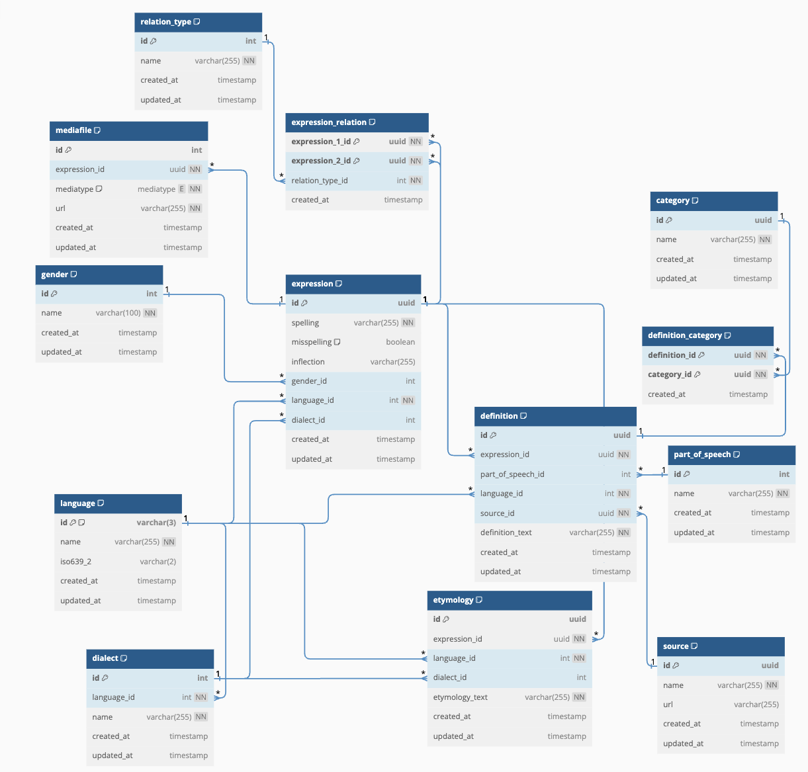

# Gafalag database dumps

- [English](#english)
- [Русский](#русский)

---

# English

This repository contains the SQL database dumps. 

Currently it is only used for the Gafalag project. 

All dumps are made from PostgreSQL 14 database.

## Dictionary version 1

This version 1 dump contains data from the following dictionaries:

- Lezgi-Russian Dictionary (Talibov B., Gadzhiev M.)
- Lezgi-Russian Dictionary 2018 (Babakhanov M.B)
- Tabasaran-Russian Dictionary (Khanmagomedov B.G.K., Shalbuzov K.T.)
- Russian-Lezgi Dictionary (Gadzhiev M.M.)

In the `dictionary_v1` folder you can find a SQL backup file. It has the following schema:

---

# Русский

В этом репозитории содержатся дампы SQL базы данных.

В настоящее время он используется только для проекта Gafalag.

Все дампы созданы из базы данных PostgreSQL 14.

## Словарь версия 1

Этот дамп содержит данные из следующих словарей:

- Лезгинско-Русский словарь (Талибов Б., Гаджиев М.)
- Лезгинско-Русский словарь 2018 (Бабаханов М.Б)
- Табасаранско-Русский словарь (Ханмагомедов Б.Г.К., Шалбузов К.Т.)
- Русско-Лезгинский словарь (Гаджиев М.М.)

В папке `dictionary_v1` находится резервный файл SQL со следующей схемой:

